# DATA 423 Assignment 03: Patient Health Analytics Dashboard

**Author:** Eduard Bradley, 13241805

This document provides a visual walkthrough of the **Patient Health Analytics Dashboard**, an interactive R Shiny application developed for **DATA 423: Data Science in Industry** at the **University of Canterbury**.

The dashboard combines exploratory data analysis, recipe preprocessing, machine learning model comparison, model optimisation, and interpretable predictive modelling within a single application.

**Live App:** [Patient Health Analytics Dashboard](https://bradley1228.shinyapps.io/data423_assignment_03/)

---

## Table of Contents

- [Part A: Data Description and EDA](#part-a-data-description-and-eda)
- [Part B: Strategies](#part-b-strategies)
- [Part C: Methods](#part-c-methods)
- [Part D: Best Model](#part-d-best-model)
- [Part E: Transparent Model](#part-e-transparent-model)
- [Part F: Conclusion](#part-f-conclusion)
- [Part G: References](#part-g-references)
- [Part H: AI Declaration](#part-h-ai-declaration)

---

# Part A: Data Description and EDA

## 1). Introduce Data

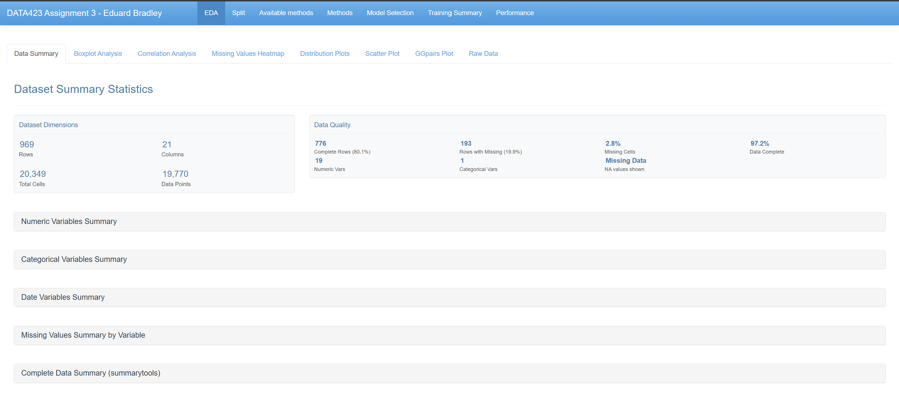

*Visualisation 01: Dashboard introduction page showing the dataset overview statistics.*

The dataset used in this data analysis is named `Ass3Data.csv`, which is an artificially generated dataset designed to simulate recorded health data of a particular response variable named **Response**. The dataset has a file size of approximately 323 KB and contains **969 rows** of observations and **21 columns** of variables, giving a total of 20,349 cells.

- **Overall data completeness:** Approximately 97.2%
- **Fully complete observations:** 776 (80.1%)
- **Observations with missing values:** 193 (19.9%)

The **Patient** column acts as a unique identifier for each individual in the study. The other categorical variable is **BloodType**, which has a cardinality of four representing the ABO blood groups: A, B, AB and O. The blood groups are relatively equally distributed.

The **ObservationDate** specifies when the results were collected, spanning from **13th September 2013 to 21st September 2021** (8.0 years total).

### Raw Overview

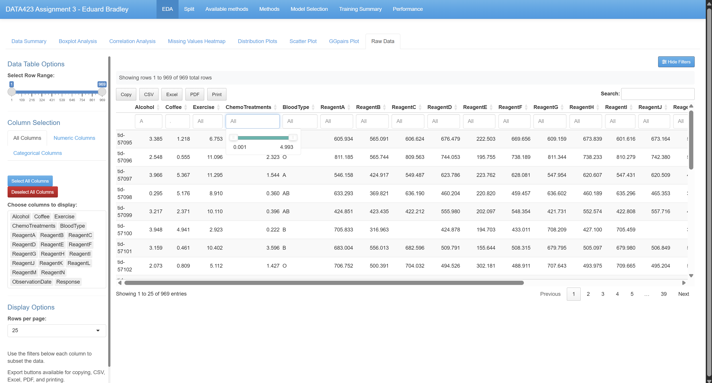

*Visualisation 02: Full view of the raw dataset for manual inspection.*

**Key Variable Information:**
- 969 observations, 21 variables
- Approximately 97.2% complete
- Continuous response variable
- Lifestyle predictors (Alcohol, Coffee, Exercise, ChemoTreatments)
- Reagent measurements (ReagentA through ReagentN)
- Blood type categories

### Observation Timeline

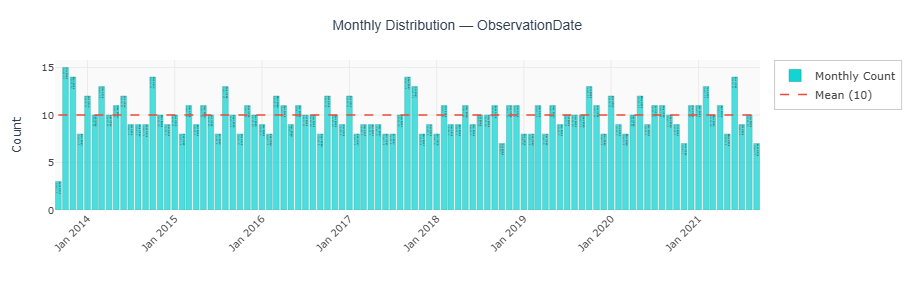

*Visualisation 03: Bar graph showing the monthly distribution of recorded observations between 13th September 2013 and 21st September 2021. The distribution of entries is relatively consistent across the 8-year period, with an average of approximately 10 observations recorded per month.*

### Numeric Variable Distribution Summary

**Table 01: Numeric Variable Distribution and Missingness Summary**

| Variable | Min | Q1 | Median | Mean | Q3 | Max | SD | N | Missing | Missing % |
|----------|-----|-----|--------|------|-----|-----|-----|-----|---------|-----------|
| Alcohol | 0 | 1.01 | 1.97 | 2.01 | 3.06 | 4 | 1.16 | 969 | 0 | 0% |
| Coffee | 0 | 1.8 | 3.55 | 3.52 | 5.26 | 7 | 2 | 969 | 0 | 0% |
| Exercise | 0 | 2.9 | 6.17 | 6.06 | 9.15 | 11.99 | 3.52 | 969 | 0 | 0% |
| ChemoTreatments | 0 | 1.31 | 2.44 | 2.48 | 3.69 | 4.99 | 1.41 | 969 | 0 | 0% |
| ReagentA | 301.19 | 613.56 | 695.8 | 695.57 | 776.26 | 1,020.06 | 120.83 | 935 | 34 | 3.50% |
| ReagentB | 230.42 | 442.14 | 501.19 | 499.74 | 554.7 | 725.65 | 83.35 | 926 | 43 | 4.40% |
| ReagentC | 302.8 | 615.7 | 698.19 | 696.88 | 778.64 | 1,018.50 | 121 | 930 | 39 | 4% |
| ReagentD | 283.28 | 534 | 601.21 | 600.02 | 667.53 | 962.98 | 100.76 | 926 | 43 | 4.40% |
| ReagentE | 71.73 | 172.5 | 201.79 | 201.36 | 225.58 | 326.41 | 39.4 | 926 | 43 | 4.40% |
| ReagentF | 288.91 | 534.39 | 602.21 | 600.2 | 667.14 | 966.64 | 100.71 | 927 | 42 | 4.30% |
| ReagentG | 304.14 | 618.74 | 700.04 | 699.25 | 779.98 | 1,022.25 | 120.57 | 928 | 41 | 4.20% |
| ReagentH | 287.63 | 535.88 | 603.07 | 600.95 | 668.84 | 963.11 | 100.71 | 936 | 33 | 3.40% |
| ReagentI | 300.51 | 616.32 | 700.07 | 697.58 | 779.9 | 1,022.77 | 121.15 | 935 | 34 | 3.50% |
| ReagentJ | 285.42 | 533.81 | 603.05 | 599.54 | 665.8 | 969.72 | 99.81 | 922 | 47 | 4.90% |
| ReagentK | 230.96 | 439.82 | 501.12 | 499.13 | 553.46 | 728.64 | 83.75 | 918 | 51 | 5.30% |
| ReagentL | 287.3 | 532.57 | 603.11 | 599.84 | 666.16 | 965.98 | 99.99 | 934 | 35 | 3.60% |
| ReagentM | 79.96 | 171.97 | 198.97 | 200.49 | 225.08 | 322.47 | 39.59 | 927 | 42 | 4.30% |
| ReagentN | 285.77 | 534.94 | 602.47 | 599.78 | 665.01 | 961.71 | 100.52 | 917 | 52 | 5.40% |
| Response | -375.28 | 2,366.64 | 2,948.10 | 2,999.96 | 3,565.00 | 6,250.15 | 916.58 | 969 | 0 | 0% |

*Table 01 summarises the distribution and missingness for all numeric variables. Missing values are present only within the reagent variables, whereas all lifestyle variables (Alcohol, Coffee, Exercise, and ChemoTreatments) and Response contain complete entries.*

## 2). Boxplot Analysis

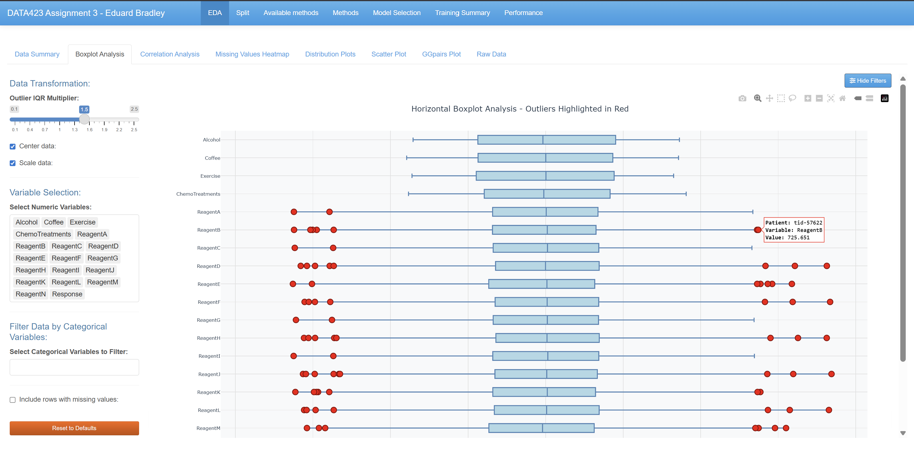

*Visualisation 04: Centred and scaled boxplots of all numeric variables using an IQR multiplier of 1.5. The lifestyle variables display comparatively low variability and narrower distributions, while the reagent variables and Response exhibit greater spread and variability across observations. All outlier observations are detected with 2.3 IQR.*

Boxplots were constructed for all numeric variables using the standard 1.5 IQR rule to identify potential outliers. No outliers were detected for the lifestyle variables. When the IQR multiplier was increased from 1.5 to **2.3**, all detected outliers disappeared across every variable.

## 3). Correlation Analysis

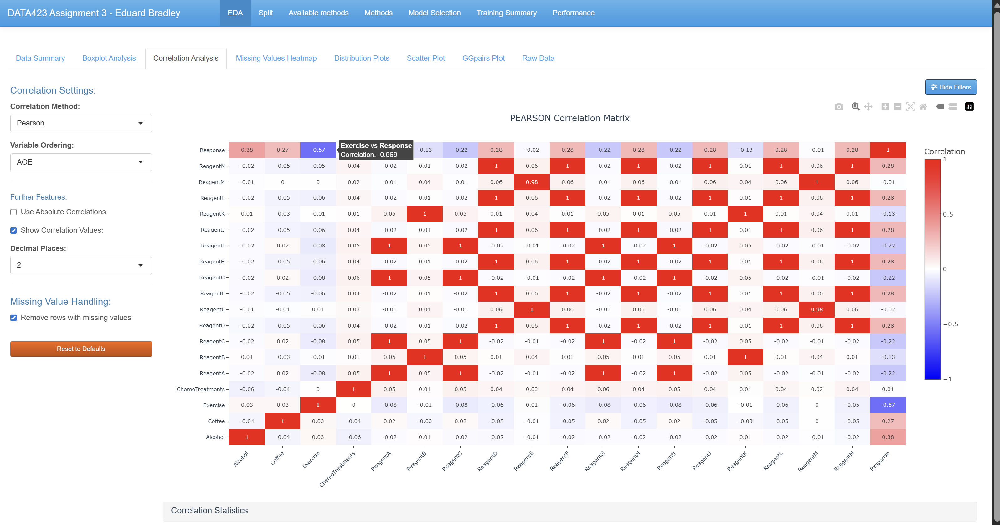

*Visualisation 05: Pearson correlation heatmap for all numeric variables, excluding observations containing missing reagent entries. The heatmap shows generally weak correlations between most variables, with Exercise displaying the strongest relationship with Response (r = −0.57). Several reagent variables exhibit extremely strong positive correlations with one another, indicating substantial multicollinearity.*

The Pearson correlation heatmap shows the linear relationships between all numeric variables. **Exercise** shows the strongest relationship with Response, with a moderate negative correlation of **r = −0.57**. Alcohol and Coffee both show weak positive correlations with Response (r = 0.38 and r = 0.29, respectively).

The reagent variables display several very strong positive correlations with one another, with many pairs approaching **r = 1.00**, indicating substantial multicollinearity.

## 4). Pairwise Variable Relationships

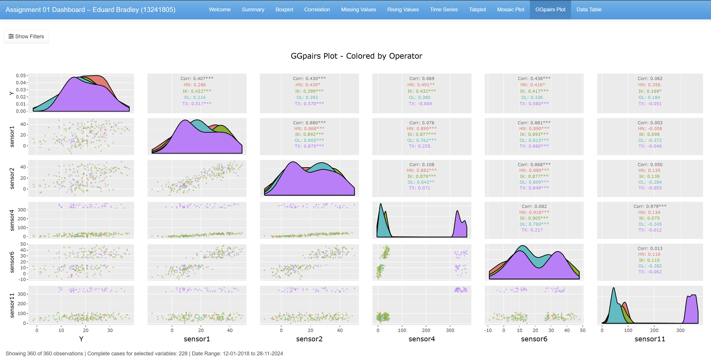

*Visualisation 06: GGPairs visualisation providing pairwise scatterplots, correlation coefficients, and variable distributions for detailed relationship exploration. This allows users to investigate patterns identified during correlation analysis. Singular plots are also available if required in the app.*

## 5). Missingness Heatmap and Tree

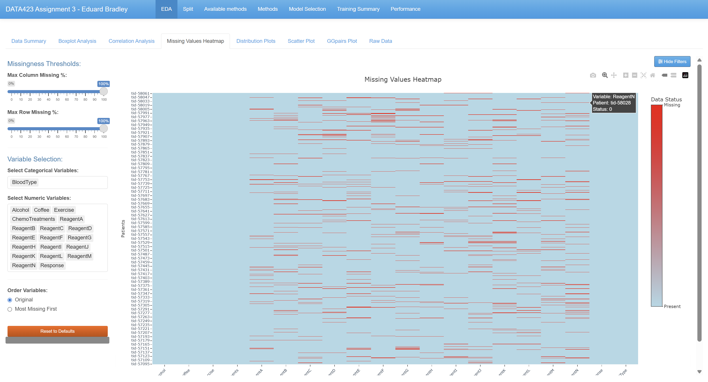

*Visualisation 07: Missingness heatmap showing the distribution of NULL values across the reagent variables. Missing values are limited to the reagent measurements, ranging from 3.4% (ReagentH) to 5.3% (ReagentN) of observations. While the heatmap suggests dispersion throughout the dataset, further analysis reveals that missingness is systematically concentrated within a specific subset of patients.*

Missing values are limited to the reagent measurements only, ranging from 3.4% (ReagentH) to 5.3% (ReagentN) of observations. However, further investigation reveals that missingness is **not random** but systematically concentrated within a specific subset of 193 patients, each having exactly three missing reagent values.

A decision tree analysis predicting the number of missing values per observation shows that missingness is almost entirely explained by the Patient variable, providing strong evidence that the missing data mechanism is **Missing Not at Random (MNAR)**.

---

# Part B: Strategies

## 1). Missing Data

Given the structured missingness pattern, deletion-based approaches were considered inappropriate. **k-Nearest Neighbours (k-NN) imputation with k=5** was selected as the most appropriate initial preprocessing strategy.

## 2). Outliers

When the IQR multiplier was increased to 2.3, all detected outliers disappeared. No observations were removed from the dataset, and no specialised robust outlier treatment methods were considered necessary.

## 3). Feature Engineering

Several preprocessing and feature engineering steps were incorporated into a common modelling recipe:

- k-NN imputation (k=5)
- Date decomposition into day-of-week
- Dummy encoding for categorical variables (BloodType, day-of-week)
- Zero variance (ZV) and near-zero-variance (NZV) removal
- Centring and scaling

## 4). Recipe

The chosen recipe applied to all candidate methods followed:
1. `impute_knn (k = 5)`
2. `step_date (dow)`
3. `step_dummy`
4. `step_zv`
5. `step_nzv`
6. `step_center`
7. `step_scale`

## 5). Tuning and Assessing

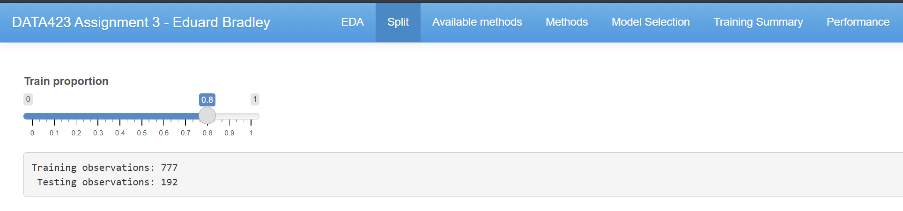

*Visualisation 08: Train-test partition visualisation. A static test set consisting of 20% of observations was reserved for final model assessment. The dataset was separated into training and testing subsets before any modelling was performed to prevent data leakage and support independent model evaluation.*

A static test set consisting of **20% of observations** was reserved for final model assessment. Hyperparameter optimisation was conducted using **25 bootstrap resamples** of the training data. Fixed random seeds were applied throughout (seed 199 for partition, seed 673 for resampling).

---

# Part C: Methods

## 1). Candidate Methods

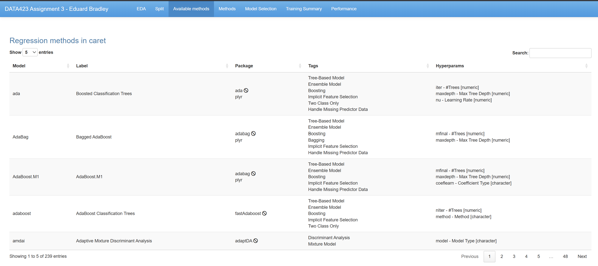

*Visualisation 09: Comprehensive overview of all regression models available in the caret framework. For each method, the table presents the underlying package, model classification tags, and tunable hyperparameters, facilitating comparison of available regression approaches.*

Candidate methods were selected to ensure broad coverage across distinct regression modelling families, including linear, nonlinear, parametric, nonparametric, Bayesian, kernel-based, ensemble, and instance-based methods.

## 2). Candidate Models

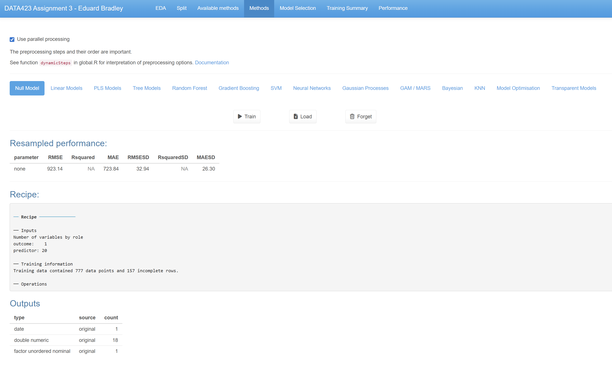

*Visualisation 10: Null model baseline providing a benchmark for prediction. All candidate models were compared against this baseline to quantify predictive improvement.*

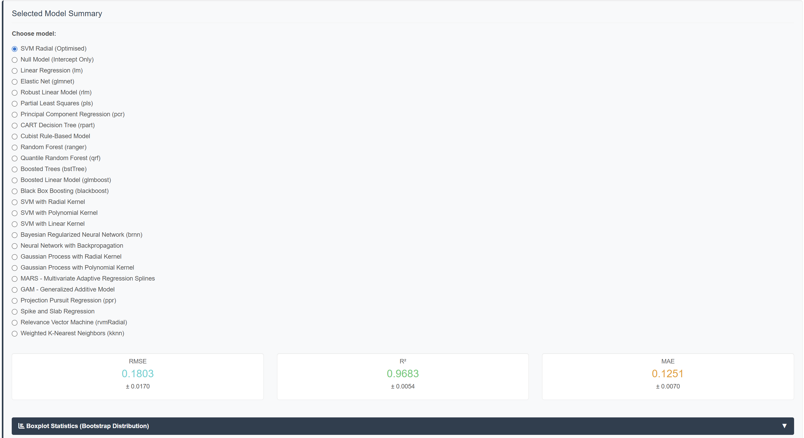

*Visualisation 11: Model selection interface allowing users to investigate candidate models following training and compare their predictive performance, including RMSE, MAE, R², and resampling results.*

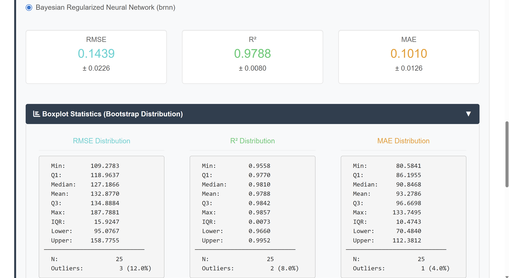

*Visualisation 12: Resampling statistics presenting key performance statistics across bootstrap resamples (brnn model).*

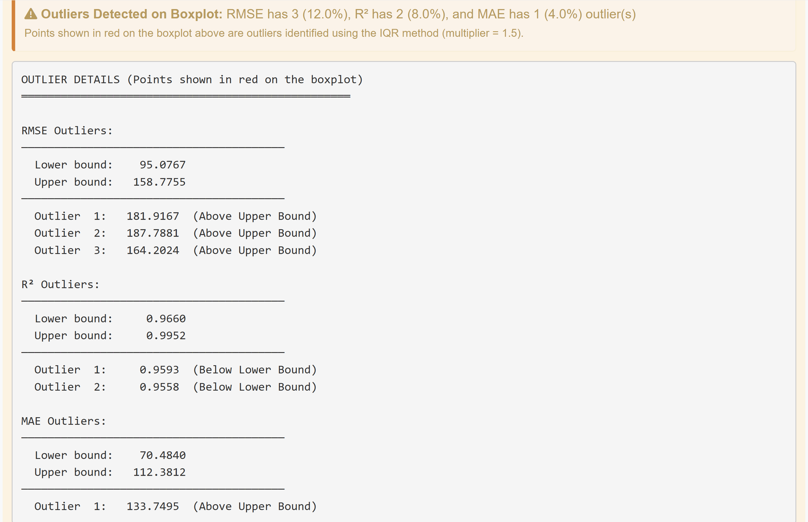

*Visualisation 13: Detected outliers from resampled performance summaries allowing comparison of model variability and consistency (brnn model).*

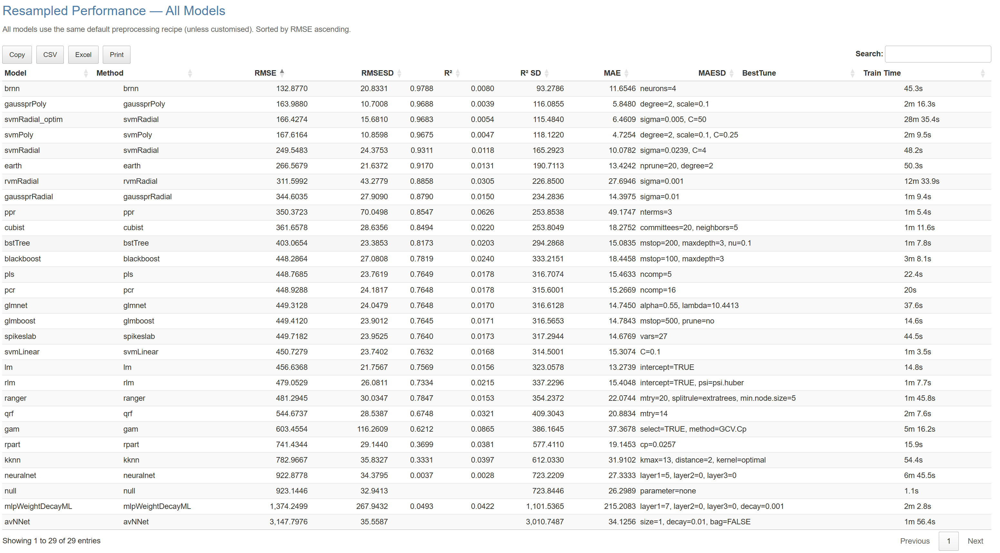

*Visualisation 14: Model comparison results showing cross-validated performance metrics across all 27 regression methods. Bayesian Regularised Neural Networks (BRNN) consistently achieved the strongest predictive performance. The best performing candidate model was brnn with an RMSE of 133.*

**Table 02: Candidate Model Performance Summary**

| Method | RMSE | RMSESD | R² | R² SD | MAE | MAESD | BestTune | Train Time |
|--------|------|--------|-----|-------|-----|-------|----------|------------|
| brnn | 132.88 | 20.8331 | 0.979 | 0.008 | 93.28 | 11.6546 | neurons=4 | 1m 0.7s |
| gaussprPoly | 163.99 | 10.7008 | 0.969 | 0.0039 | 116.09 | 5.848 | degree=2, scale=0.1 | 2m 16.3s |
| svmPoly | 167.62 | 10.8598 | 0.968 | 0.0047 | 118.12 | 4.7254 | degree=2, scale=0.1, C=0.25 | 2m 9.5s |
| svmRadial | 249.55 | 24.3753 | 0.931 | 0.0118 | 165.29 | 10.0782 | sigma=0.0239, C=4 | 48.2s |
| earth | 266.57 | 21.6372 | 0.917 | 0.0131 | 190.71 | 13.4242 | nprune=20, degree=2 | 50.3s |
| rvmRadial | 311.60 | 43.2779 | 0.886 | 0.0305 | 226.85 | 27.6946 | sigma=0.001 | 12m 33.9s |
| gaussprRadial | 344.60 | 27.909 | 0.879 | 0.015 | 234.28 | 14.3975 | sigma=0.01 | 1m 9.4s |
| ppr | 350.37 | 70.0498 | 0.855 | 0.0626 | 253.85 | 49.1747 | nterms=3 | 1m 5.4s |
| cubist | 361.66 | 28.6356 | 0.849 | 0.022 | 253.80 | 18.2752 | committees=20, neighbors=5 | 48.3s |
| bstTree | 403.07 | 23.3853 | 0.817 | 0.0203 | 294.29 | 15.0835 | mstop=200, maxdepth=3, nu=0.1 | 1m 7.8s |
| blackboost | 448.29 | 27.0808 | 0.782 | 0.024 | 333.22 | 18.4458 | mstop=100, maxdepth=3 | 3m 8.1s |
| pls | 448.77 | 23.7619 | 0.765 | 0.0178 | 316.71 | 15.4633 | ncomp=5 | 22.4s |
| pcr | 448.93 | 24.1817 | 0.765 | 0.0178 | 315.60 | 15.2669 | ncomp=16 | 20s |
| glmnet | 449.31 | 24.0479 | 0.765 | 0.017 | 316.61 | 14.745 | alpha=0.55, lambda=10.4413 | 37.6s |
| glmboost | 449.41 | 23.9012 | 0.765 | 0.0171 | 316.57 | 14.7843 | mstop=500, prune=no | 14.6s |
| spikeslab | 449.72 | 23.9525 | 0.764 | 0.0173 | 317.29 | 14.6769 | vars=27 | 44.5s |
| svmLinear | 450.73 | 23.7402 | 0.763 | 0.0168 | 314.50 | 15.3074 | C=0.1 | 1m 3.5s |
| rlm | 454.84 | 22.3557 | 0.759 | 0.0151 | 318.19 | 14.1551 | intercept=TRUE, psi=psi.huber | 37.7s |
| lm | 456.64 | 21.7568 | 0.757 | 0.0156 | 323.06 | 13.2739 | intercept=TRUE | 14.8s |
| ranger | 481.29 | 30.0347 | 0.785 | 0.0153 | 354.24 | 22.0744 | mtry=20, splitrule=extratrees, min.node.size=5 | 1m 45.8s |
| qrf | 544.67 | 28.5387 | 0.675 | 0.0321 | 409.30 | 20.8834 | mtry=14 | 2m 7.6s |
| gam | 603.46 | 116.2609 | 0.621 | 0.0865 | 386.16 | 37.3678 | select=TRUE, method=GCV.Cp | 5m 16.2s |
| rpart | 741.43 | 29.144 | 0.370 | 0.0381 | 577.41 | 19.1453 | cp=0.0257 | 15.9s |
| kknn | 782.97 | 35.8327 | 0.333 | 0.0397 | 612.03 | 31.9102 | kmax=13, distance=2, kernel=optimal | 54.4s |
| neuralnet | 922.88 | 34.3795 | 0.004 | 0.0028 | 723.22 | 27.3333 | layer1=5, layer2=0, layer3=0 | 6m 45.5s |
| null | 923.14 | 32.9413 | N/A | N/A | 723.84 | 26.2989 | parameter=none | 1.1s |
| mlpWeightDecayML | 1374.25 | 267.9432 | 0.049 | 0.0422 | 1101.54 | 215.2083 | layer1=7, layer2=0, layer3=0, decay=0.001 | 2m 2.8s |
| avNNet | 3147.80 | 35.5587 | N/A | N/A | 3010.75 | 34.1256 | size=1, decay=0.01, bag=FALSE | 1m 56.4s |

#please change for four models

## 3). Model Optimisation

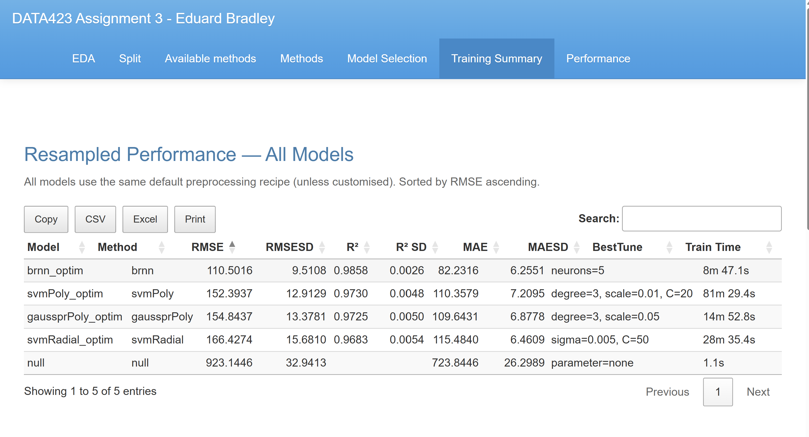

*Visualisation 15: Optimised models comparison showing the performance of the four best candidate models after expanded hyperparameter optimisation and bagged imputation. Training time is also provided.*

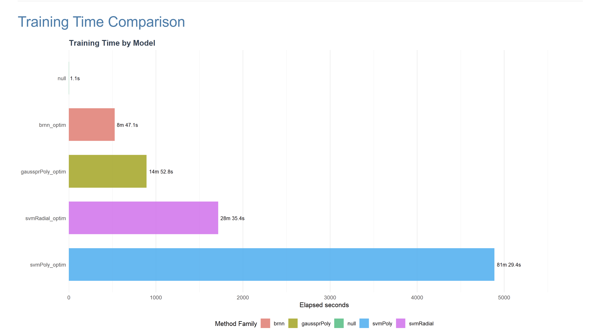

*Visualisation 16: Computational runtime for each optimised model.*

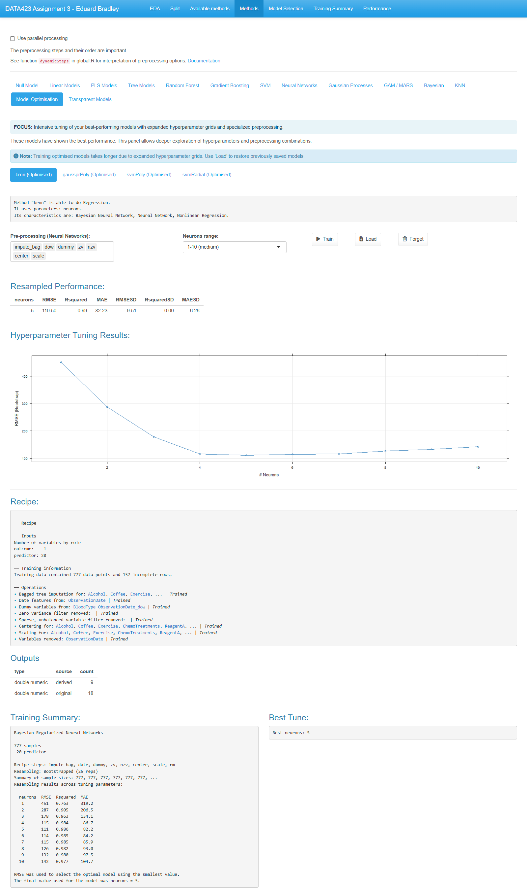

*Visualisation 17: Detailed resampling diagnostics for the highest-performing BRNN model, demonstrating strong and consistent predictive capability.*

**Table 03: Optimised Model Results**

| Model             | CV RMSE    | CV R²     | Train Time | Train RMSE | Test RMSE | RMSE Change | Test R²    |
| ----------------- | ---------- | --------- | ---------- | ---------- | --------- | ----------- | ---------- |
| **brnn_optim**    | **110.50** | **0.986** | 8m 47s     | **73.79**  | **79.72** | **+8.03%**  | **0.9916** |
| svmPoly_optim     | 152.39     | 0.973     | 81m 29s    | 74.03      | 116.37    | +57.18%     | 0.9822     |
| gaussprPoly_optim | 154.84     | 0.973     | 14m 53s    | 62.46      | 106.84    | +71.05%     | 0.9850     |
| svmRadial_optim   | 166.43     | 0.968     | 28m 35s    | 84.60      | 127.42    | +50.62%     | 0.9786     |

*brnn_optim demonstrated the strongest and most stable generalisation performance, with the smallest gap between training and testing error.*

---

# Part D: Best Model

## 1). Optimised Models' Performance on Unseen Data

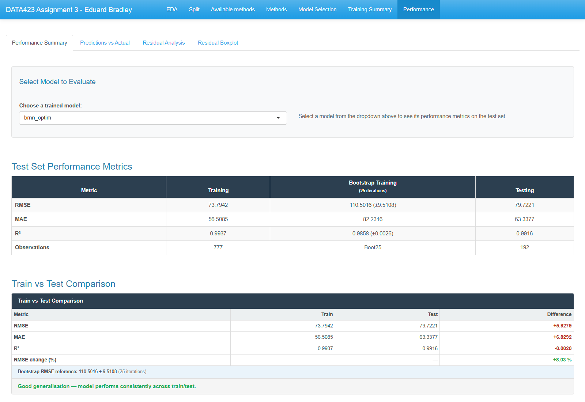

*Visualisation 18: Combined view of train, resampled train, and test metrics for the brnn_optim model*

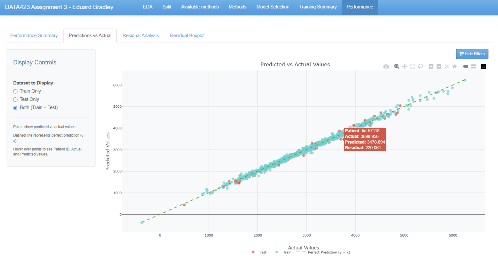

*Visualisation 19: Train and Test combined view of predicted and actual observations from the brnn_optim model*

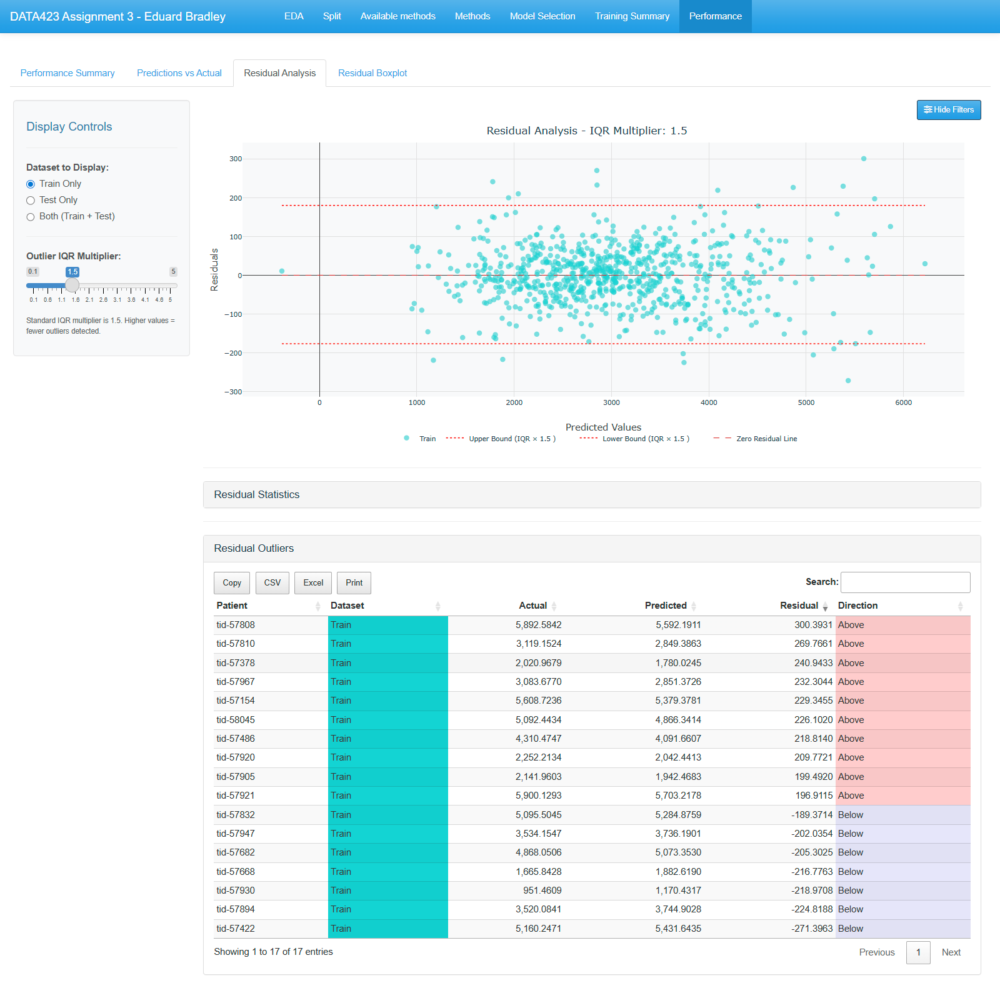

*Visualisation 20: BRNN training results showing predicted versus actual values. Training predictions closely align with observed values, demonstrating the model's ability to capture complex nonlinear relationships.*

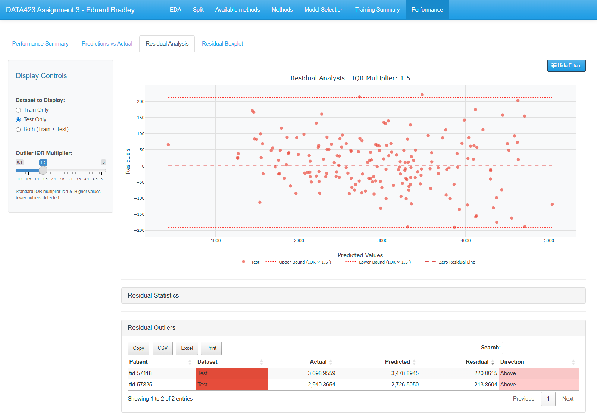

*Visualisation 21: BRNN testing results showing predicted versus actual values. Testing RMSE: 79.7, Testing R²: 0.9916. The small gap between training and testing performance indicates excellent generalisation and minimal overfitting.*

## 2) Best Model Theory Explanation

The Bayesian Regularized Neural Network (BRNN) extends a standard neural network by incorporating a probabilistic regularisation framework that helps reduce overfitting and improve model generalisation. Rather than minimising only the prediction error, the BRNN minimises the following objective function:

$$
F = \beta E_D + \alpha E_W
$$

where:

- $E_D$ is the sum of squared errors, representing the model's fit to the training data.
- $E_W$ is the sum of squared network weights, representing model complexity.
- $\beta$ controls the importance of the data-fitting term.
- $\alpha$ controls the strength of the weight penalty (regularisation).

During training, both $\alpha$ and $\beta$ are automatically estimated using Bayesian evidence procedures. This allows the model to balance predictive accuracy and complexity without requiring manual tuning of regularisation parameters.

The relatively small difference between the training RMSE (73.8) and testing RMSE (79.7) suggests that the regularisation mechanism was effective, enabling the model to generalise well to unseen data while limiting overfitting.

---

# Part E: Transparent Model

## 1). Transparent Model Development

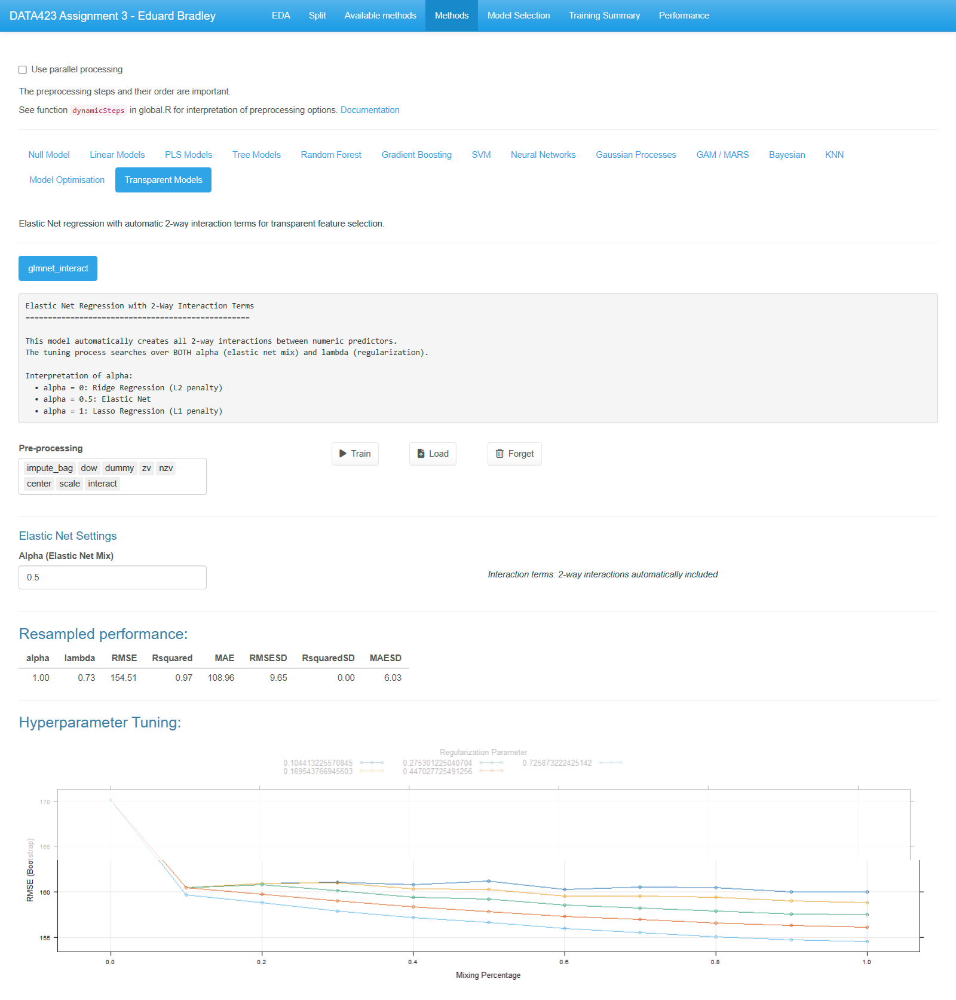

*Visualisation 22: glmnet model overview showing the transparent model structure using elastic net regularisation, automatic feature selection, pairwise interaction terms, and coefficient shrinkage.*

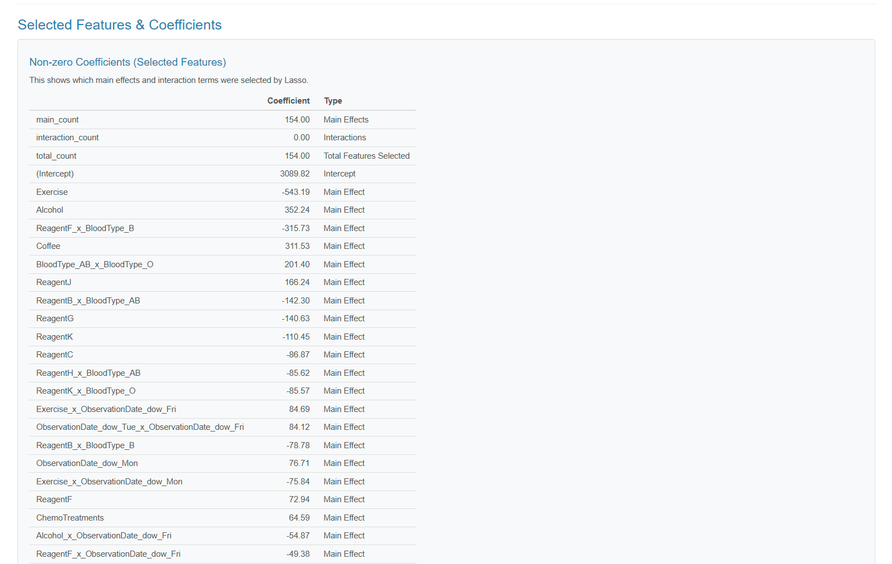

*Visualisation 23:* Top 25 coefficents out of 154 for the glmnet_interact model.

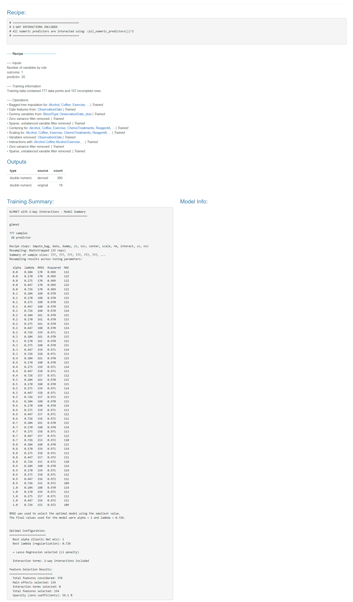

*Visualisation 24:* Landing on best alpha of 1 and regularsion lambda parameter of 0.726. landed on using 154 coefficintes to make the model.

*Visualisation 25: glmnet training results demonstrating the model's ability to explain variation within the dataset while retaining transparency.*

*Visualisation 25: glmnet testing results showing strong predictive performance. Testing RMSE: 133.4, Testing R²: 0.977.*

**Table 05: Transparent Model Comparison**

| Model | Bootstrap RMSE | R² | Train Time |
|-------|----------------|-----|-------------|
| GLMNET (no interactions) | 449.31 | 0.76 | 37.6s |
| **GLMNET (with interactions)** | **154.24** | **0.97** | **8m 47s** |
| Null model | 923.14 | N/A | 1.1s |

## 2) Transparent Model Theory Explanation

The **glmnet** algorithm combines both L1 (Lasso) and L2 (Ridge) regularisation penalties through the Elastic Net framework. The L1 component is particularly valuable for interpretability because it can shrink some coefficients exactly to zero, effectively performing automatic feature selection and removing less important predictors from the model.

The prediction equation remains fully interpretable:

$$
\hat{y} = \beta_0 + \sum_{j=1}^{p} \beta_j x_j
$$

where:

- $\beta_0$ is the intercept term.
- $\beta_j$ represents the coefficient associated with predictor $x_j$.
- $x_j$ represents the value of predictor $j$.
- $\hat{y}$ is the predicted response value.

For the final model, the estimated intercept was:

$$
\beta_0 = 3089.82
$$

Each coefficient quantifies the expected change in the predicted outcome associated with a one-unit increase in the corresponding predictor, holding all other variables constant.

### Key Coefficients from the Final Model

- **Exercise:** $-543.19$ (largest negative influence on the predicted outcome)
- **Alcohol:** $+352.24$ (strong positive contribution)
- **Coffee:** $+311.53$ (strong positive contribution)
- **ReagentF × BloodType_B:** $-315.73$ (negative interaction effect)

The sparse nature of the glmnet model allows important predictors to be identified directly from the coefficient estimates, making the model substantially more interpretable than many complex machine learning alternatives while still maintaining strong predictive performance.

---

# Part F: Conclusion

Overall, this project demonstrated the value of systematic model comparison and candidate model selection within a predictive modelling framework. The use of the caret package provided a structured and reproducible approach to model training, hyperparameter tuning, and resampling-based performance evaluation, enabling fair comparison across a range of regression techniques.

- **Best predictive performance:** `brnn_optim` (RMSE = 79.7, R² = 0.9916)
- **Best transparent model:** `glmnet_interact` (RMSE = 133.4, R² = 0.977)

The analysis highlighted the importance of considering both performance and explainability when selecting models for applied problems, particularly in healthcare contexts where model transparency is critical.

---

# Part G: References

- Perez-Rodriguez, Paulino, and Daniel Gianola. *brnn: Bayesian Regularization for Feed-Forward Neural Networks*. R package version 0.9.4, CRAN, 2025.
- Foresee, F. Darrell, and Martin T. Hagan. "Gauss-Newton Approximation to Bayesian Learning." *Proceedings of the International Conference on Neural Networks*, IEEE, 1997.
- MacKay, David J. C. "A Practical Bayesian Framework for Backpropagation Networks." *Neural Computation*, vol. 4, no. 3, 1992.
- Rudin, Cynthia. "Stop Explaining Black Box Machine Learning Models for High-Stakes Decisions and Use Interpretable Models Instead." *Nature Machine Intelligence*, vol. 1, no. 5, 2019.
- Zou, Hui, and Trevor Hastie. "Regularization and Variable Selection via the Elastic Net." *Journal of the Royal Statistical Society: Series B*, vol. 67, no. 2, 2005.
- Friedman, Jerome, Trevor Hastie, and Robert Tibshirani. "Regularization Paths for Generalized Linear Models via Coordinate Descent." *Journal of Statistical Software*, vol. 33, no. 1, 2010.
- Tibshirani, Robert. "Regression Shrinkage and Selection via the Lasso." *Journal of the Royal Statistical Society: Series B*, vol. 58, no. 1, 1996.

---

# Part H: Artificial Intelligence Declaration

During the preparation of this report, DeepSeek, Claude and ChatGPT were employed to support code development, identify and resolve coding errors, and refine the written expression of the technical content. These tools were used solely for debugging assistance and stylistic improvements. The underlying data analysis, interpretation of results, and all substantive conclusions are entirely my own.

---

# Technologies Used

- R
- Shiny
- caret
- brnn
- glmnet
- GGally
- ggplot2
- Plotly
- visdat
- DT
- rpart

---
This project was completed as **Assignment 03 for DATA 423 (Data Science in Industry)** at the **University of Canterbury**.

The dataset is a simulated patient health dataset designed to emulate a clinical trial environment and provide opportunities for advanced predictive modelling and machine learning evaluation.
