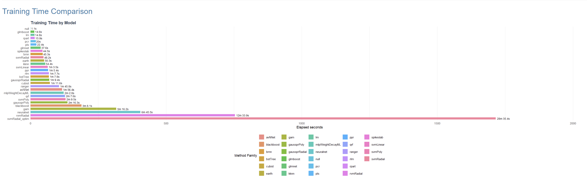
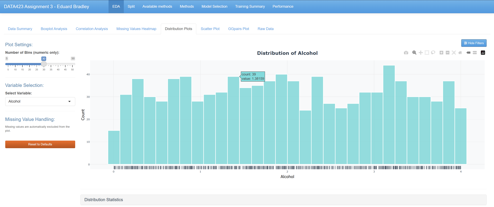
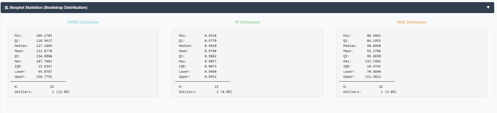
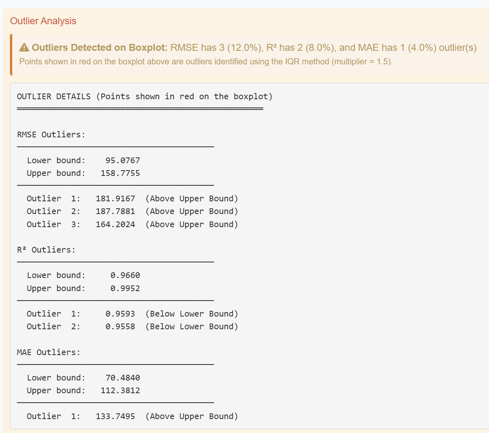
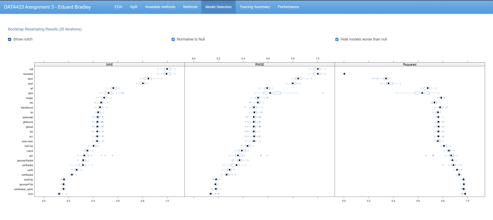
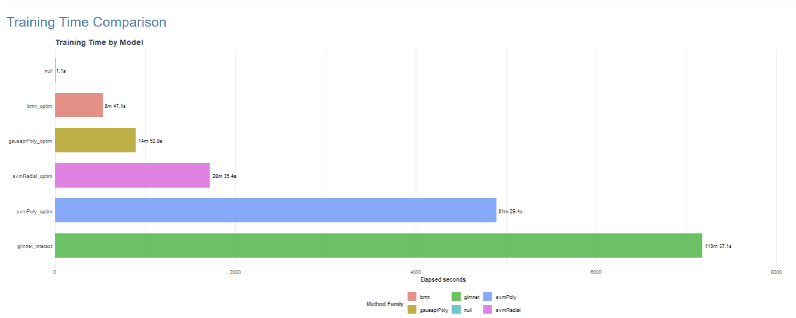
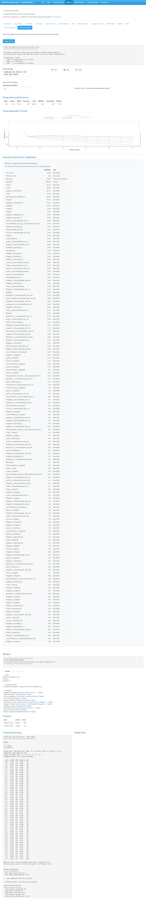

# Patient Health Analytics Dashboard – Modelling Workflow

This document provides a visual walkthrough of the **Patient Health Analytics Dashboard**, an interactive R Shiny application developed for **DATA 423: Data Science in Industry** at the **University of Canterbury**.

The dashboard combines exploratory data analysis, missing data investigation, machine learning model comparison, model optimisation, and interpretable predictive modelling within a single application.

**Live App:** [Patient Health Analytics Dashboard](https://bradley1228.shinyapps.io/data423_assignment_03/)

---

# Project Overview

The project was developed using a simulated clinical trial dataset containing:

* 969 patient observations
* 21 variables
* Lifestyle predictors
* Laboratory reagent measurements
* Blood type information
* Observation dates
* A continuous biomarker response variable

The primary objective was to identify predictors of the response variable and develop accurate predictive models while maintaining transparency and reproducibility.

---

# Dashboard Introduction

The application begins with an overview page describing the project, dataset, analytical workflow, and key findings.

This section provides context for the analysis and guides users through the dashboard's functionality.

---

# Dataset Overview

The dataset overview summarises the structure and composition of the data.

### Key Information

* 969 observations
* 21 variables
* Approximately 97.2% complete
* Continuous response variable
* Lifestyle predictors
* Reagent measurements
* Blood type categories

This section allows users to familiarise themselves with the available data before beginning detailed analysis.

---

# Observation Timeline

Observation dates span approximately eight years.

The timeline visualisation helps users understand the temporal distribution of observations and identify any potential clustering or collection patterns.

---

# Exploratory Data Analysis

The EDA section provides multiple visualisations for understanding the characteristics of the dataset.

---

## Variable Distributions

Distribution plots allow users to examine:

* Variable spread
* Central tendency
* Skewness
* Potential outliers

These plots provide an initial understanding of how variables are distributed throughout the dataset.

---

## Scatterplot Analysis

Scatterplots allow direct investigation of relationships between predictors and the response variable.

### Key Findings

* Exercise exhibits the strongest relationship with the response variable.
* Alcohol and Coffee show weaker positive associations.
* Several variables demonstrate nonlinear relationships.

---

## Correlation Analysis

The correlation matrix summarises relationships among all numeric variables.

### Key Findings

* Exercise has the strongest correlation with Response.
* Reagent variables display substantial multicollinearity.
* Several reagent pairs approach near-perfect correlation.

This analysis was critical for understanding the underlying structure of the dataset.

---

## Pairwise Variable Relationships

The GGPairs visualisation provides:

* Pairwise scatterplots
* Correlation coefficients
* Variable distributions
* Detailed relationship exploration

This allows users to investigate patterns identified during correlation analysis.

---

## Boxplot Analysis

Interactive boxplots support investigation of variable distributions and outlier behaviour.

### Key Finding

Outliers detected using the standard 1.5×IQR rule disappeared when the multiplier was increased to approximately 2.3×IQR, suggesting naturally occurring distribution tails rather than true anomalies.

---

# Missing Data Investigation

Understanding missing-data behaviour formed an important component of the project.

## Missingness Visualisation

The missingness heatmap reveals structured missingness among reagent variables.

### Key Findings

* Missing values occur only within reagent variables.
* 193 patients contain missing values.
* 776 patients are completely observed.

This pattern suggested a non-random missing-data mechanism and motivated further investigation.

---

# Modelling Workflow

The dashboard documents each stage of the predictive modelling process.

---

## Train-Test Partitioning

The dataset was separated into training and testing subsets before any modelling was performed.

### Purpose

* Prevent data leakage
* Support independent model evaluation
* Enable reproducible model development

---

## Available Regression Methods

Twenty-seven regression algorithms were evaluated using the caret framework.

Model families included:

* Linear models
* Penalised regression
* Neural networks
* Support vector machines
* Gaussian processes
* Bayesian approaches
* Instance-based learners

This broad comparison ensured that both simple and complex modelling approaches were considered.

---

## Model Selection Interface

The dashboard allows users to investigate candidate models and compare their predictive performance.

Users can review:

* RMSE
* MAE
* R²
* Resampling results

---

## Null Model Baseline

The null model provides a baseline prediction benchmark.

All candidate models were compared against this baseline to quantify predictive improvement.

---

## Model Comparison Results

Cross-validated performance metrics were compared across all 27 regression methods.

### Key Finding

Bayesian Regularised Neural Networks (BRNN) consistently achieved the strongest predictive performance.

Top-performing methods included:

1. BRNN
2. Gaussian Process Regression
3. Polynomial Support Vector Machines
4. Radial Support Vector Machines

---

# Resampling Assessment

Bootstrap resampling was used to evaluate model stability and generalisation performance.

---

## Resampling Statistics

The first summary presents key performance statistics across bootstrap resamples.

---

## Additional Resampling Statistics

Additional performance summaries allow comparison of model variability and consistency.

---

## Resampling Visualisation

These visualisations help assess:

* Model robustness
* Performance variability
* Stability across resamples

---

## BRNN Resampling Information

Detailed diagnostics are provided for the highest-performing BRNN model.

These results demonstrate the model's strong and consistent predictive capability.

---

# Optimised Model Performance

Following the initial model comparison, the strongest candidate models underwent additional optimisation.

---

## Optimised Models

The optimisation workflow incorporated:

* Expanded tuning grids
* Bagged imputation
* Additional hyperparameter searches
* Enhanced preprocessing

This process further improved predictive performance.

---

## Performance versus Runtime

This visualisation demonstrates the trade-off between computational cost and predictive accuracy.

Users can compare whether additional training time produces meaningful improvements in performance.

---

# Best Model: Bayesian Regularised Neural Network

The optimised BRNN model achieved the strongest overall performance.

---

## BRNN Training Results

Training predictions closely align with observed values, demonstrating the model's ability to capture complex nonlinear relationships.

---

## BRNN Testing Results

### Performance

* Test RMSE: 79.7
* Test R²: 0.9916

The small gap between training and testing performance indicates excellent generalisation and minimal overfitting.

---

# Transparent Predictive Model

Although BRNN provided the best predictive performance, an interpretable alternative was also developed.

---

## glmnet Model Overview

The transparent model uses:

* Elastic net regularisation
* Automatic feature selection
* Pairwise interaction terms
* Coefficient shrinkage

This approach provides substantially greater interpretability while maintaining strong predictive accuracy.

---

## glmnet Training Performance

Training results demonstrate the model's ability to explain variation within the dataset while retaining transparency.

---

## glmnet Testing Performance

### Performance

* Test RMSE: 133.4
* Test R²: 0.977

Although slightly less accurate than BRNN, the transparent model remains highly competitive and provides clear explanations of variable effects.

---

# Project Summary

The Patient Health Analytics Dashboard demonstrates the complete data science workflow within a single interactive application.

The project integrates:

* Exploratory data analysis
* Missing-data investigation
* Feature engineering
* Predictive modelling
* Model comparison
* Hyperparameter optimisation
* Model validation
* Explainable machine learning

The final BRNN model achieved exceptional predictive performance, while the interaction-expanded glmnet model provided an interpretable alternative suitable for environments where transparency is important.

---

# Technologies Used

* R
* Shiny
* caret
* brnn
* glmnet
* GGally
* ggplot2
* Plotly
* visdat
* DT
* rpart

---

# Academic Context

This project was completed as **Assignment 03 for DATA 423 (Data Science in Industry)** at the **University of Canterbury**.

The dataset is a simulated patient health dataset designed to emulate a clinical trial environment and provide opportunities for advanced predictive modelling and machine learning evaluation.
