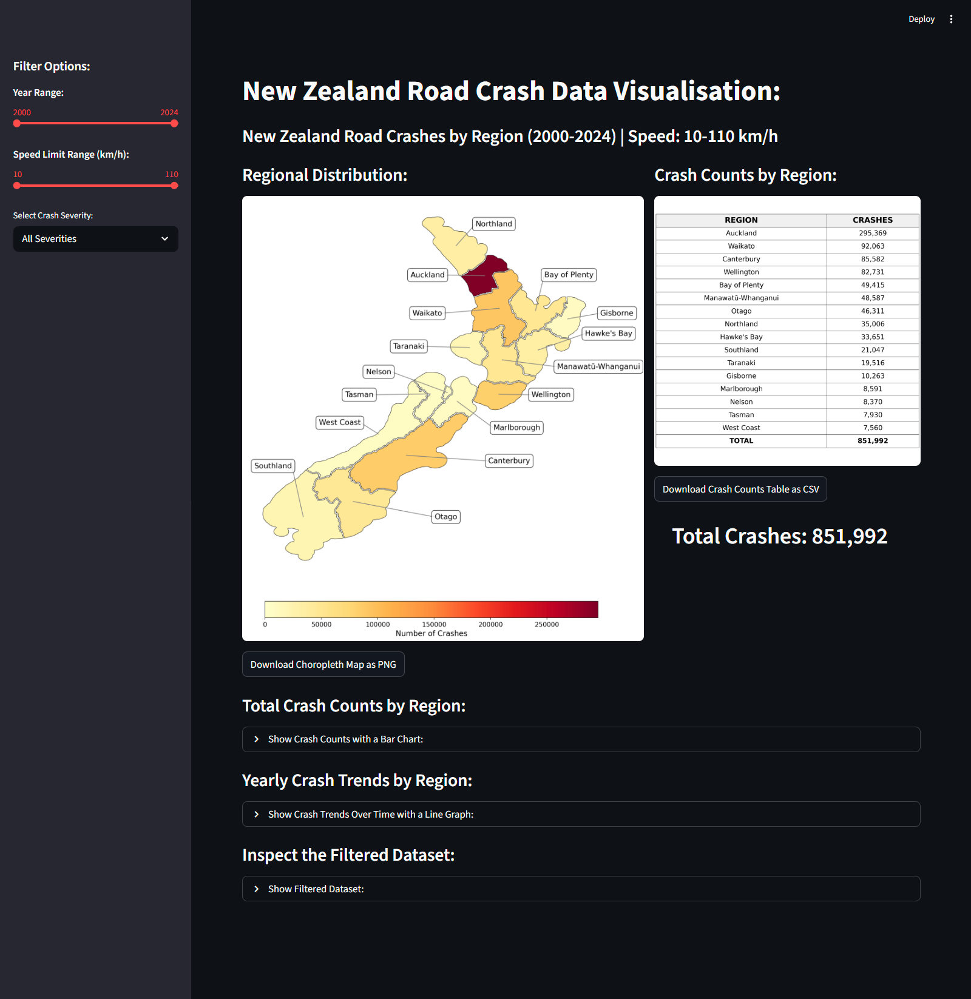
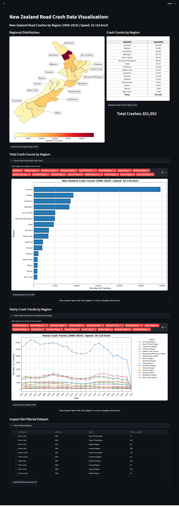
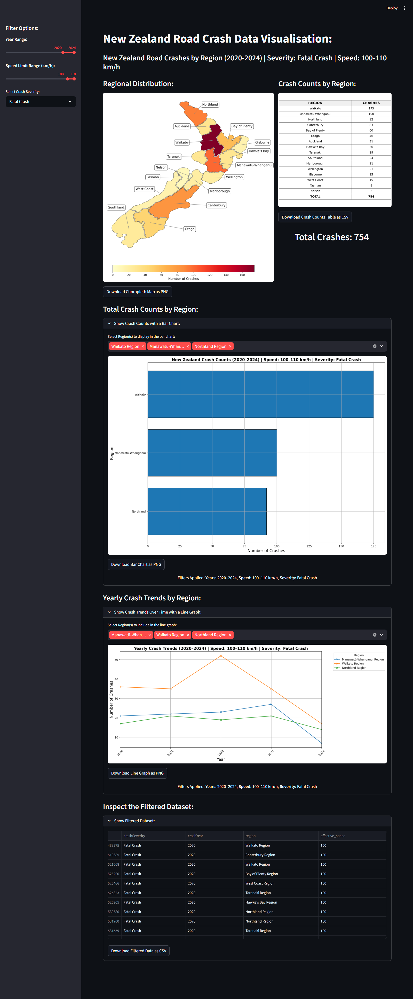

# NZ Crash Data Dashboard - Application Walkthrough

This document provides a visual walkthrough of the **NZ Crash Data Dashboard**, an interactive web application developed for **COSC480 Assignment 3** at the **University of Canterbury**.

The application uses crash data sourced from the New Zealand Transport Agency (Waka Kotahi) Crash Analysis System (CAS) and allows users to explore road safety trends across New Zealand through interactive filtering, mapping, and visualisation tools.

---

## Live Application

https://nz-crash-clean-bradley.streamlit.app/

---

# Dashboard Overview

The dashboard was developed using **Python**, **Streamlit**, **Pandas**, **GeoPandas**, and **Matplotlib** to provide an accessible platform for exploring New Zealand road crash data.

Users can interactively filter crash records by:

* Year range
* Crash severity
* Road speed limits
* Region

Visualisations update automatically based on user selections, allowing rapid exploration of crash patterns and trends.

---

# Main Dashboard Interface

The default dashboard view displays the complete crash dataset with no filters applied.

### Features Displayed

* Interactive filter controls
* Crash summary statistics
* Regional crash totals
* Time-series visualisations
* Download options for charts and filtered datasets
* Expandable visualisation panels

### Purpose

This view provides users with an immediate overview of crash patterns across New Zealand and serves as the starting point for more detailed analysis.

### Key Functionality

Users can:

* Explore crash trends across all years
* Compare crash counts between regions
* Export filtered data as CSV files
* Download generated visualisations as PNG images

---

# Expanded Visualisation View

The dashboard includes several expandable analysis sections designed to reduce clutter while still providing detailed analytical capabilities.

### Available Visualisations

#### Regional Crash Comparison

The regional bar chart allows users to compare total crash counts between regions.

This visualisation helps identify regions with consistently higher crash frequencies and supports comparisons under different filtering scenarios.

#### Time-Series Analysis

The interactive line graph displays crash trends over time.

Users can:

* Select specific regions
* Compare multiple regions simultaneously
* Explore changes in crash frequency over time
* Investigate long-term road safety trends

#### Data Exploration Table

The interactive data table allows direct inspection of the filtered crash records.

Features include:

* Sorting
* Searching
* Filtering
* Exporting results

This provides transparency and allows users to examine the observations underlying each visualisation.

---

# Example Analysis Using Filters

The dashboard supports scenario-based exploration through interactive filtering.

The example below applies the following criteria:

* Years: 2020–2024
* Speed limits: 100–110 km/h
* Crash severity: Fatal

For the visualisations, the following regions were selected:

* Northland
* Waikato
* Manawatū-Whanganui

### Purpose

This example demonstrates how users can investigate a highly specific road safety scenario.

Rather than viewing all crash records, users can focus on:

* High-speed roads
* Fatal crashes
* Recent years
* Specific regions of interest

### Insights Supported

Using this filtered view, users can:

* Identify which selected regions experienced the highest number of fatal crashes
* Compare trends between regions over time
* Examine the underlying crash records through the data table
* Export both the visualisations and filtered dataset for reporting purposes

This type of targeted analysis allows users to investigate specific road safety concerns and identify areas where intervention or further study may be warranted.

---

# Technical Features

The application incorporates several features designed to improve performance and usability.

### Interactive Filtering

All visualisations update automatically in response to user selections, eliminating the need to rerun scripts or regenerate reports manually.

### Geospatial Analysis

Regional crash counts are merged with New Zealand regional boundary data to support choropleth mapping and geographic analysis.

### Data Export

Users can export:

* Filtered datasets as CSV files
* Generated visualisations as PNG images

### Performance Optimisation

Streamlit caching functions are used to improve responsiveness and reduce repeated data processing.

---

# Technologies Used

* Python
* Streamlit
* Pandas
* GeoPandas
* Matplotlib

---

# Project Summary

The NZ Crash Data Dashboard transforms static crash reports into an interactive analytical environment.

The application enables users to:

* Explore crash patterns across New Zealand
* Compare regions
* Analyse trends over time
* Investigate crash severity and speed-related factors
* Perform targeted road safety analysis
* Export both visualisations and data for further reporting

The project demonstrates the integration of data analytics, geospatial visualisation, interactive dashboard design, and web application development within a real-world road safety context.
