# Manufacturing Dashboard - Application Walkthrough

This document provides a visual walkthrough of the Manufacturing Dashboard developed as part of **DATA 423: Data Science in Industry** at the **University of Canterbury**.

The dashboard was built using **R Shiny** to support exploratory data analysis (EDA) of a manufacturing monitoring dataset containing sensor measurements, operational variables, and categorical descriptors collected between January 2018 and November 2024.

---

## Access the Application

**Live App:** https://bradley1228.shinyapps.io/assignment_01_v3/

---

# Welcome Page

The welcome page introduces the project, explains the purpose of the dashboard, and provides guidance for navigating the available analyses.

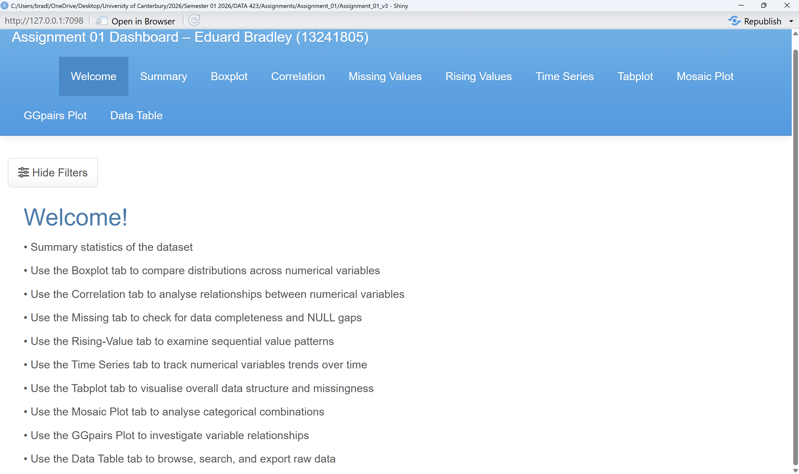

### Purpose

* Introduce the manufacturing dataset
* Explain dashboard objectives
* Provide user instructions
* Outline available visualisations

---

# Main Dashboard

The main dashboard serves as the central navigation point for all analysis modules.

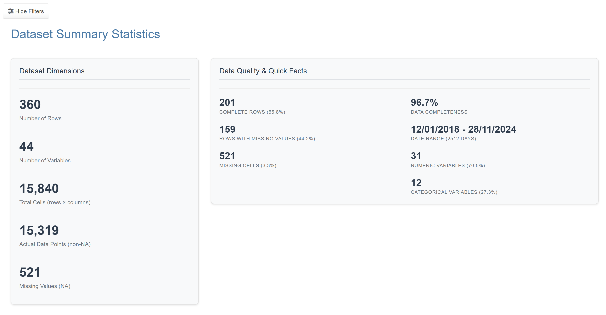

### Features

* Dashboard navigation controls
* Interactive visualisation selection
* Access to all analytical components
* User-friendly layout for exploratory analysis

---

# Dataset Overview

This section provides a summary of the dataset structure and data quality.

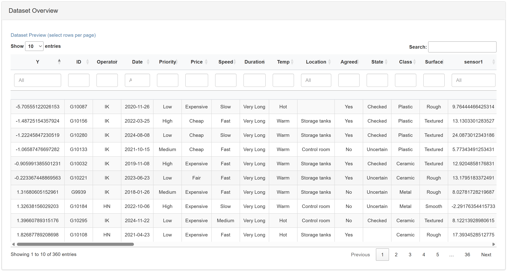

### Dataset Characteristics

* 360 observations
* 44 variables
* Approximately 96% complete
* Numeric and categorical variables
* Weekly observations spanning six years

### Insights

Users can quickly assess dataset size, completeness, and overall structure before conducting detailed analyses.

---

# Numeric Variable Summary Table

The numeric variable summary provides descriptive statistics for all sensor variables and the response variable.

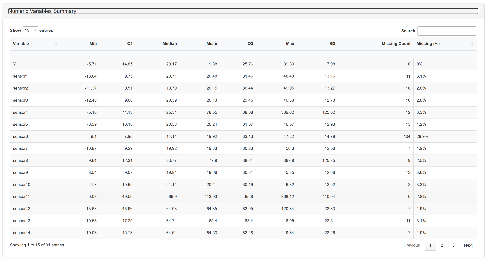

### Statistics Available

* Mean
* Median
* Standard deviation
* Minimum value
* Maximum value
* Quartiles
* Missing value counts

### Purpose

This table enables rapid assessment of variable distributions and identification of unusual measurements.

---

# Boxplot Analysis

Boxplots are used to investigate distributions, variability, and outlier behaviour across sensor variables.

### Features

* Adjustable IQR multiplier
* Outlier identification
* Standardised and raw-scale views
* Group-specific visualisation options

### Key Findings

Analysis revealed substantial outlier behaviour within Group A sensors, with extreme values largely associated with observations recorded during the TX operator period.

---

# Correlation Matrix

Correlation matrices are used to explore relationships between sensor variables.

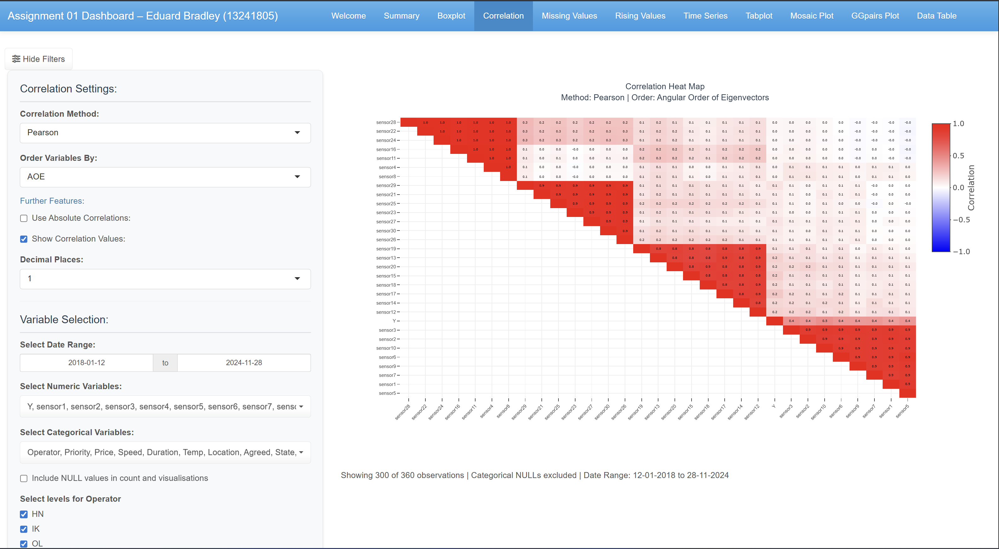

### Features

* Pearson correlation coefficients
* Spearman correlation coefficients
* Eigenvector variable ordering
* Interactive exploration

### Key Findings

Correlation analysis identified four distinct sensor groups that exhibited strong within-group relationships and differing behavioural patterns.

---

# Missing Values Analysis

Missingness plots provide insight into data completeness and potential missing-data mechanisms.

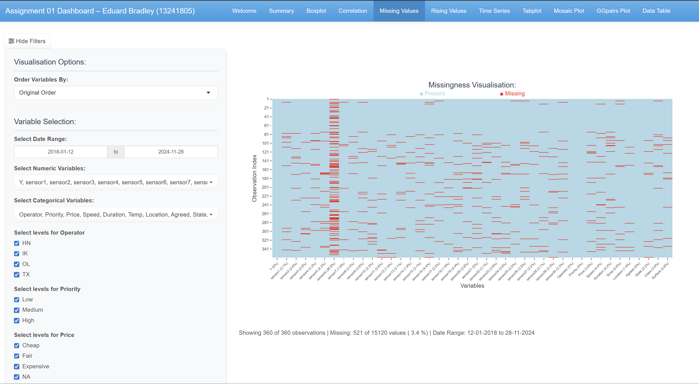

### Features

* Dataset-wide missingness visualisation
* Individual variable inspection
* Chronological observation ordering

### Key Findings

The analysis highlighted that sensor6 contains substantially more missing values than any other variable in the dataset.

---

# Rising-Order Charts

Rising-order charts sort observations from smallest to largest, making distributional structures easier to identify.

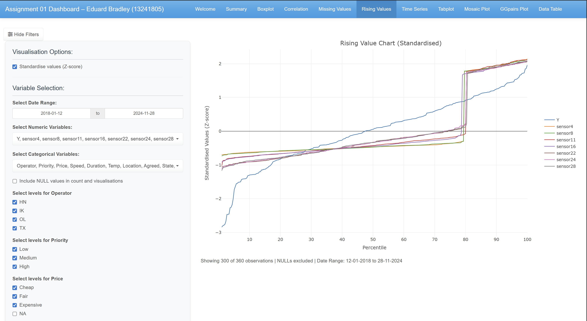

### Features

* Raw-scale visualisation
* Standardised Z-score visualisation
* Group-specific exploration
* Comparative analysis

### Key Findings

These plots were instrumental in identifying sensor groupings and revealing the distinct behaviour associated with the TX operator period.

---

# Time Series Analysis

Time series plots allow users to investigate how sensor measurements change over time.

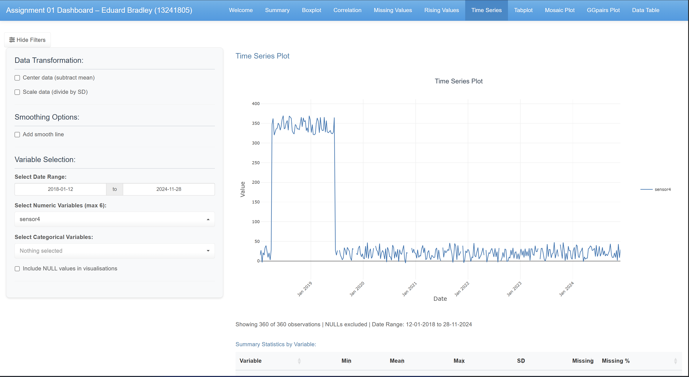

### Features

* Individual sensor analysis
* Sensor group visualisation
* TX operator filtering
* Longitudinal trend exploration

### Key Findings

Time series analysis revealed a distinct operating regime between March 2018 and June 2019 that corresponded to observations associated with the TX operator.

---

# Tabplot

The tabplot combines categorical and numeric variables into a single compact visualisation ordered chronologically.

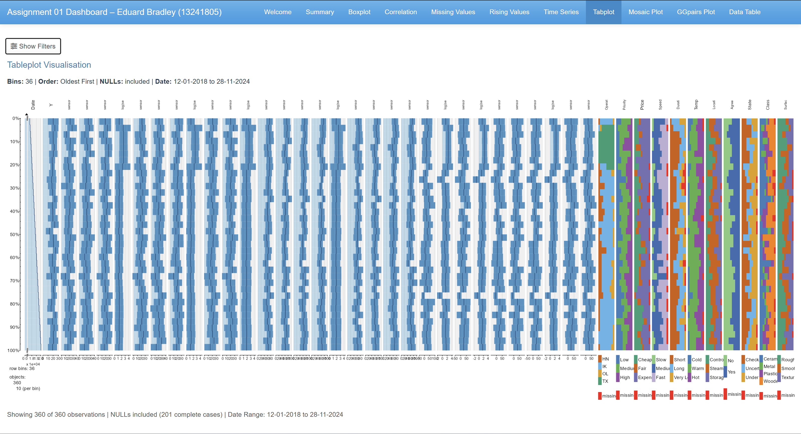

### Features

* Simultaneous display of multiple variables
* Temporal ordering of observations
* Pattern recognition across variable types
* Compact dataset overview

### Purpose

The tabplot provides a high-level summary of the entire dataset and supports discovery of relationships that may not be apparent in isolated visualisations.

---

# Mosaic Plot

Mosaic plots are used to investigate associations between categorical variables.

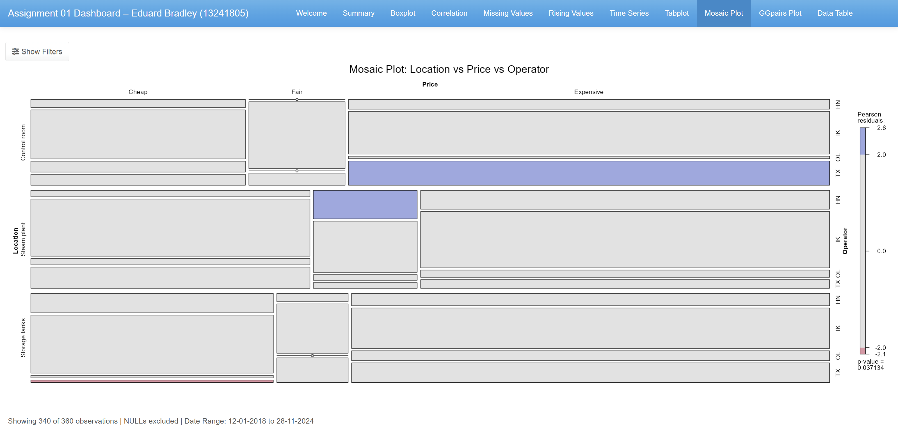

### Features

* Frequency visualisation
* Pearson residual colouring
* Multi-way categorical analysis
* Statistical relationship assessment

### Key Findings

The mosaic analysis identified a statistically significant relationship between Location, Price, and Operator, highlighting patterns within manufacturing operations.

---

# GGally Pairwise Analysis

Pairwise scatterplot matrices provide detailed investigation of relationships between selected variables.

### Features

* Pairwise scatterplots
* Correlation coefficients
* Variable distributions
* Colouring by operator category

### Purpose

These plots support deeper investigation of sensor relationships and provide visual confirmation of the group structures identified through correlation analysis.

---

# Interactive Data Table

The dashboard includes a fully interactive data table for detailed inspection of individual observations.

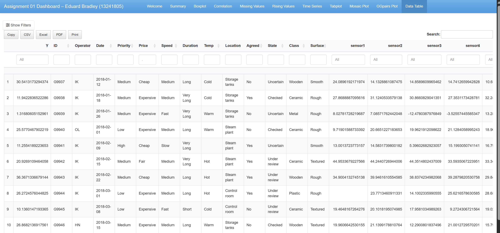

### Features

* Search functionality
* Column sorting
* Data filtering
* Full dataset exploration

### Purpose

The table allows users to validate observations, investigate anomalies, and inspect records underlying patterns identified in the visualisations.

---

# Summary

The Manufacturing Dashboard integrates a range of exploratory data analysis techniques into a single interactive application.

Through visual and statistical analysis, the dashboard enables users to:

* Explore dataset structure and quality
* Investigate missing values
* Examine sensor distributions
* Identify outliers
* Discover correlation structures
* Analyse temporal patterns
* Explore categorical relationships
* Inspect individual observations

The dashboard successfully revealed four distinct sensor groups, identified the influence of the TX operator period, characterised missing-data patterns, and highlighted key relationships within the manufacturing process.

---

## Technologies Used

* R
* Shiny
* Plotly
* GGally
* corrplot
* corrgram
* visdat
* vcd
* tabplot
* DT

---

## Project Context

This application was developed for **DATA 423 – Data Science in Industry** at the **University of Canterbury**.

The dataset used in this project is an artificially generated manufacturing monitoring dataset designed to simulate real-world industrial process data and support exploratory data analysis techniques commonly used in industry.
